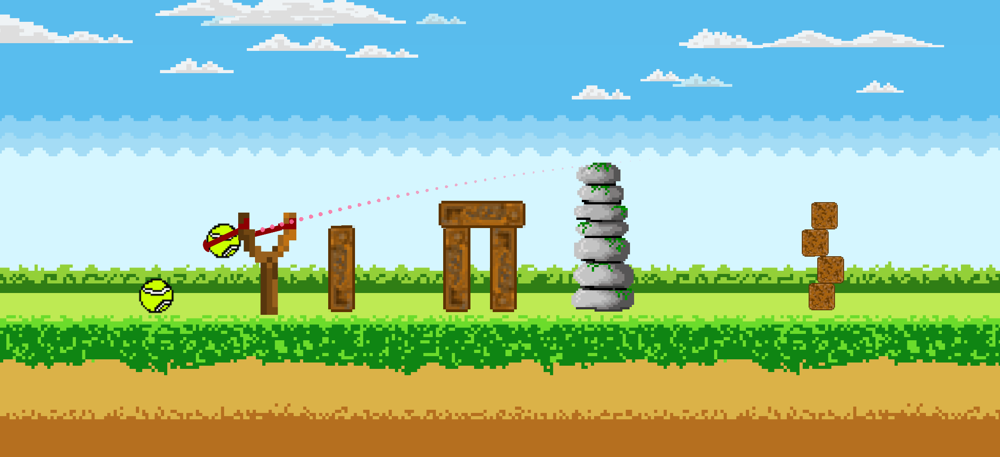

# 🎮 Welcome to Haft Sangs! 🎮

## 🌟 Game Overview
We all have played the game of "Haft Sang" (Seven Stones) at least once in our lives. Some of us might have even spent our childhood playing it. It’s a traditional Iranian game filled with energy, teamwork, joy, and noise, and it knows no age limits. Welcome to Haft Sangs.

## 🎨 Game Style
The whole game style is pixel art and pixelized, bringing a nostalgic and charming visual experience.

## 🕹️ Gameplay
- **Waiting List:** Enter the waiting list and wait for an opponent to be found.
- **Game Start:** The guide at the top of the screen will inform you whether to set up obstacles to defend your stones or attack the opponent's stones and obstacles with the ball to score points.
- **Game Flow:** Arrange obstacles freely to defend your stones and enjoy the game's flow.

## 🌐 Platforms
Haft Sangs is available at [haftsangs.ir](http://haftsangs.ir) in Android, Linux, and web formats. Make sure your VPN is off and your internet speed is high to enjoy the game.

## 🚀 Future Plans
We are continuously working on improving the game and adding new features to enhance your gaming experience. Stay tuned for exciting updates!

## 📺 YouTube Video
Check out our [YouTube video](https://www.youtube.com/watch?v=JYxYxM_fcXw) showcasing the game!

Enjoy the game and relive the joy of Haft Sang! 🎉🕹️
